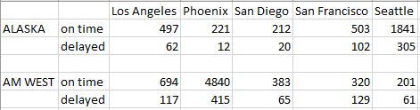

```{r setup, include=FALSE}
knitr::opts_chunk$set(echo = TRUE, results='hide', message=FALSE, warning=FALSE, comments=NA)
```

# <span style="color: #969696;">Introduction - Week 5 Assignemnt</span> 
<span style="color: #969696;">The task for this week's assignment is to:  

* <span style="color: #969696;">Create a .CSV file (or optionally, a MySQL database!) that includes all of the information above. You’re encouraged to use a “wide” structure similar to how the information appears above, so that you can practice tidying and transformations as described below,
* <span style="color: #969696;">Read the information from your .CSV file into R, and use tidyr and dplyr as needed to tidy and transform your data.
* <span style="color: #969696;">Perform analysis to compare the arrival delays for the two airlines.
* <span style="color: #969696;">Your code should be in an R Markdown file, posted to rpubs.com, and should include narrative descriptions of your data cleanup work, analysis, and conclusions. Please include in your homework submission:  
    * The URL to the .Rmd file in your GitHub repository.  
    * The URL for your rpubs.com web page.

# Load Packages
Load the packages necessary for this assignment.
```{r, results='hide', message=FALSE, warning=FALSE, comments=NA}
library(tidyverse)
library(RCurl)
library(knitr)
library(ggrepel)
library(cowplot)
```

# Part 1 - Create a .csv file
The first step is to recreate the table from the assignment rubric.
```{r, results='asis', echo=FALSE}
#Create link
link <- "https://raw.githubusercontent.com/sbiguzzi/data607assignment5/master/flightdata.png"

#Download file
download.file(link,"flightdata.png", mode = 'wb')

#Include the graphic

```

# Part 2 -  Load file and tranform data
This next step is asking us to import the .csv file created above and preform different functions to transform the data and get it ready for analysis.

## Loading the data
This first step is loading the data
```{r}
data <-
  getURL("https://raw.githubusercontent.com/sbiguzzi/data607assignment5/master/flightdata.csv")
flightdata <- read.csv(text = data)
```

## Transforming data
We notice that the data isn't set up great for analysis. The first thing to do is rename all the columns for readability. Second, there is a full empty row that needs to be removed. Third, the company name is only available for one of the rows that belongs to the airline. This needs to be fixed. And finally, we want to change the shape of the data from wide to long as it will be easier to analyze.

1. Renaming columns
```{r}
#Remove periods in column names
names(flightdata) <- gsub("\\.","_",names(flightdata))
#Rename first two columns
flightdata <- rename(flightdata,c("Airline" = "X_U_FEFF_", "Flight_Status" = "X"))
```

2. Remove third row
```{r}
#Remove third now
flightdata <- flightdata[-c(3),]
#Resetting index
rownames(flightdata) <- NULL
```

3. Fill airline company name
```{r}
#Convert blanks to na in Airline Company
flightdata$Airline <- na_if(flightdata$Airline,"")
#Fill company names to appropriate rows
flightdata <- fill(flightdata,Airline,.direction = "down")
```

4. Convert data from wide to long
```{r}
#Make data long format
flightdata_long <- flightdata %>%
  gather(Airport,Flight_Counts,Los_Angeles:Seattle, factor_key = TRUE)
#Replace underscore with space
flightdata_long$Airport <- gsub("\\_"," ",flightdata_long$Airport)
#Transpose on-time and delayed
flightdata_long <- flightdata_long %>%
  spread(Flight_Status,Flight_Counts)
```
```{r, echo=FALSE}
flightdata_long <- rename(flightdata_long,c("Delayed" = "delayed", "On_Time" = "on time"))
```

# Part 3 - Analysis
Now that the data is in the long format we are able to run some analyses. First we want to compare the overall on-time performance for both airlines. Then compare the per-city on-time performance for both airlines.

## Compare the overall on-time performance for both airlines

To understand the overall on time performance of each airline we create a column `total_on_time` that groups by airline and divides the sum of the on time flights by the sum of the on time and delayed flights.
```{r, echo=FALSE}
flightdata_long <- flightdata_long %>%
  group_by(Airline) %>%
  mutate(airline_on_time = sum(On_Time)/(sum(On_Time)+sum(Delayed)))
```

Using the new column we create `Fig 1`. From `Fig 1`, we see that AM WEST has a better overall on time percent for it's flights than ALASKA.
```{r, results='asis', echo=FALSE, fig.align='left'}
plot <-
  ggplot(
    as.data.frame(
      distinct(flightdata_long,airline_on_time)
    ),
    aes(
      y = airline_on_time,
      x = Airline,
      fill=Airline)) +
  geom_bar(stat = "identity",show.legend = FALSE) +
  scale_y_continuous(
    expand = expansion(mult = c(0,.059))) +
  ylab(element_blank()) + 
  xlab(element_blank()) +
  ggtitle(
    "Fig 1: Total on time performance by airline")

label <-
  geom_text(
    aes(
      label=paste(
        as.character(
          round(airline_on_time*100, digits = 0)),
        "%",
        sep=""),
      color=Airline,
      fontface = "bold"),
    vjust=-0.2,
    hjust=0.4,
    size=7,
    show.legend = FALSE) 

theme <-
  theme(
    axis.line.x = element_line(colour = "black"),
    axis.line.y = element_blank(),
    panel.background = element_blank(),
    axis.ticks = element_blank(),
    axis.text.x = element_text(size = 12, vjust=2),
    axis.text.y = element_blank())

plot + label + theme
```

## Compare the per city on-time performance by airline

First we have to create a new column called `on_time_per`, which is the number of on time flights divided by the total flights to each airport. Keeping in mind to group by airline company as well.
```{r, echo=FALSE}
flightdata_long <- flightdata_long %>%
  mutate(airport_on_time = On_Time/(On_Time+Delayed))
```

We can use the new column to create `Fig 2`. After examining `Fig 2` we see that AM WEST in reality has less on time flights at every airport in the data, which contradicts `Fig 1`.
```{r, echo=FALSE, fig.align='center'}
plot2 <-
  ggplot(
    flightdata_long,
    aes(fill=Airline, y=airport_on_time, x=Airport)) +
  geom_bar(
    width = 0.6,
    position = position_dodge(width = 0.7),
    stat = "identity") +
  ylab(element_blank()) +
  xlab(element_blank()) +
  ggtitle(
    "Fig 2: Percent on time by city and company") + 
  scale_y_continuous(
    expand = expansion(mult = c(0,.059)))

label2 <-
  geom_text(
    aes(
      label=paste(as.character(
        round(airport_on_time*100, digits = 0)),
      "%",
      sep=""),
      color=Airline,
      fontface = "bold"),
    position=position_dodge(width=0.7),
    vjust=-0.2,
    hjust=0.47,
    size=4,
    show.legend = FALSE)

plot2 + label2 + theme
```

# Part 4 - Conclusion: The Paradox

The paradoxical conclusion here is that AM WEST is both the airline with the most on time flights and the airline with the least on time flights.

To understand this paradox we can look at the scatter plot in `Fig 3` and the box plot in `Fig 4`. We see that both airlines have an outlier in their data, for ALASKA it's the flights to Seattle and for AM WEST it's the flights to  Phoenix. When we split the data by airport this outlier is not an issue as we are grouping the on time performance by both airline and airport as seen in `Fig 2`. However, when we only group by airlines and we exclude airports, the additional 4,840 on time Phoenix flights skews the percent of total on time flights for AM WEST more than the 1,841 on time Seattle flights skews the percent for on time flights for ALASKA.
```{r, results = 'asis', echo=FALSE, fig.align='left'}
#Create function to get outliers in data
is_outlier <- function(x) {
  return(
    x < quantile(x, 0.25) - 1.5 * IQR(x) |
      x > quantile(x, 0.75) + 1.5 * IQR(x))
}

#Apply function to flightdata_long
flightdata_long <- flightdata_long %>%
  group_by(Airline) %>%
  mutate(outlier = ifelse(
    is_outlier(On_Time),On_Time,as.numeric(NA)))

#Create scatter plot
plot3 <- 
  ggplot(
    flightdata_long,
    aes(
      x=(On_Time+Delayed),
      y=On_Time,
      color=Airline)) +
  geom_point(size=5, show.legend = FALSE) +
  ylab("Total on time") +
  xlab("Total flights") +
  ggtitle("Fig 3: Total on time vs Total flights") +
  scale_y_continuous(
    expand = expansion(mult = c(.047,.059))
  ) +
  scale_x_continuous(
    expand = expansion(mult = c(.047,.03))
  )

label3 <- geom_label_repel(
  data = subset(flightdata_long, On_Time > 1000),
  aes(
    label=paste(
      Airport,
      as.character(On_Time),
      sep=", ")),
  show.legend=FALSE,
  box.padding=0.35,
  point.padding = 0.5)

theme3 <- theme(
  axis.line = element_line(colour = "black"),
  panel.background = element_blank(),
  axis.text.x = element_text(size = 10, vjust=2),
  axis.text.y = element_text(size = 10),
  legend.key = element_blank())

#Create median labels
ontime_meds <- flightdata_long %>%
  group_by(Airline) %>%
  mutate(med = median(On_Time))
ontime_meds <-
  as.data.frame(distinct(ontime_meds,med))

#Create box plot
plot4 <-
  ggplot(
    data = flightdata_long,
    aes(x=Airline, y=On_Time,fill=Airline)) +
  geom_boxplot(show.legend = FALSE) +
  ylab(element_blank()) +
  xlab("Airline") +
  ggtitle("Fig 4: Total on time flights box plot") +
  scale_y_continuous(
    expand = expansion(mult = c(0.047,0.045))) +
  geom_text(
    data = ontime_meds,
    aes(
      x = Airline,
      y = med,
      label = med,
      color = Airline,
      fontface = "bold"),
    hjust = -2.30,
    show.legend = FALSE)

label4 <-
  geom_text(
    aes(
      label = outlier,
      color=Airline,
      fontface="bold"),
    na.rm = TRUE,
    hjust = -0.2,
    show.legend = FALSE)

theme4 <- theme(
  axis.line.x = element_line(colour = "black"),
  axis.line.y = element_blank(),
  panel.background = element_blank(),
  axis.text.x = element_text(size = 10, vjust=2),
  axis.text.y = element_blank(),
  legend.key = element_blank(),
  axis.ticks = element_blank())

contra_plot1 <- plot3+label3+theme3
contra_plot2 <- plot4+label4+theme4

plot_grid(contra_plot1,contra_plot2)
```

The reason we see AM WEST have 89% on time total flights compared to ALASKA's 87% on time is because of these outliers. In fact if we look at the median of the box plot in `Fig 4`, we see that AM WEST's on time flights (`383`) is lower than ALASKA's (`497`) flights. The recommendation here is to look deeper into the data than just base summaries as you may find that your initial conclusion might be skewed by outliers. Sometimes it is worth looking deeper into the data than just base percent calculations or else you may end up with paradoxical conclusions like the one above.

***


<div class="tocify-extend-page" data-unique="tocify-extend-page" style="height: 0;"></div>
